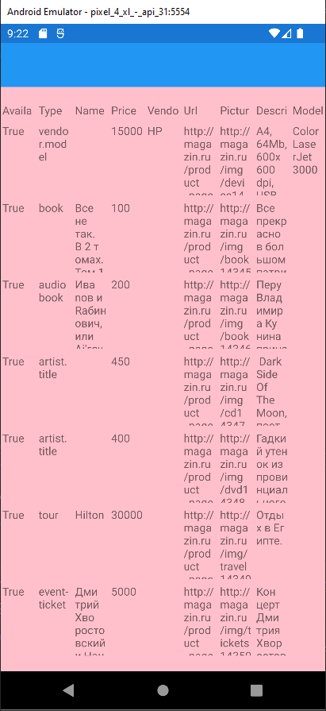
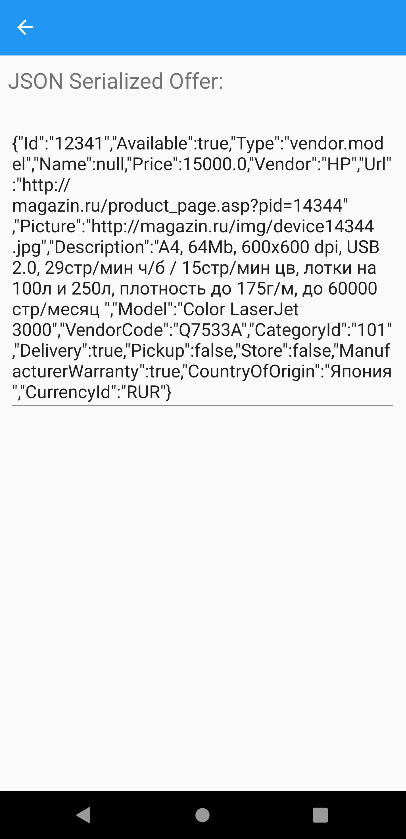

# Xamarin Xml to Json parser
Это простой проект Xamarin, который содержит одностраничное андроид-приложение, отображающее список товаров из API-интерфейса. В этом проекте использованы такие технологии, как Xamarin.Forms и Newtonsoft.Json.

Проект включает в себя парсинг XML-файла с использованием асинхронного подхода. В процессе парсинга, данные из xml файла преобразуются в объектные модели, которые далее выводятся на экран в виде таблицы. Кроме того, приложение имеет возможность отображать сериализованный в json объект по нажатию на каждый элемент в таблице. Для этого используется библиотека Newtonsoft.Json. 

Если по какой-то причине ссылка на xml-каталог перестанет быть доступной, в репозитории имеется файл YML.xml, которым при желании можно заменить ссылку.

# Скриншоты
Главное окно программы:

При нажатии на любую ячейку:


# Установка
Чтобы запустить проект, необходимо сначала склонировать его с помощью команды:
```bash
git clone https://github.com/BogaRU/XamarinXmlToJsonParser.git
```
Затем открыть решение в Visual Studio и запустить его.

# Дополнительная информация
Проект создан в образовательных целях и может быть использован в качестве отправной точки для создания более сложных приложений Xamarin.
